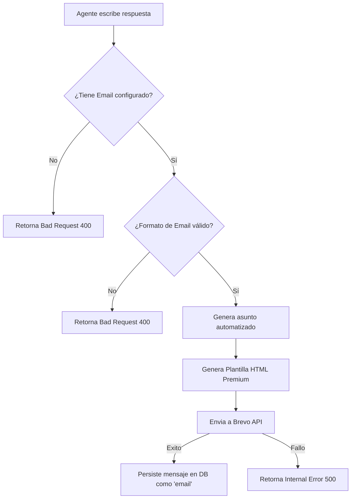

# Notificaciones y Respuestas por Email (Brevo)

Este documento detalla el funcionamiento de las respuestas y actualizaciones vía correo electrónico integradas en los tickets de Obertrack mediante la API Transaccional de **Brevo (Sendinblue)**.

---

## 1. Flujo del Servicio de Emails

Cuando un agente decide responder a un ticket utilizando el canal de **Email**, el sistema valida la información localmente en el servidor antes de realizar la conexión SMTP externa.



---

## 2. Validación de Destinatarios

Para evitar peticiones fallidas y asegurar una excelente experiencia de usuario, el backend valida el estado de la dirección de correo antes del envío (`ticket_handler.go`):

```go
trimmedEmail := strings.TrimSpace(ticket.Contact.Email)
if trimmedEmail == "" {
    c.JSON(http.StatusBadRequest, gin.H{"error": "El contacto no tiene un correo electrónico configurado"})
    return
}
if !strings.Contains(trimmedEmail, "@") {
    c.JSON(http.StatusBadRequest, gin.H{"error": "El contacto no tiene un correo electrónico válido"})
    return
}
```

Si el envío falla por validación o error del proveedor, el frontend captura la respuesta de error de red y muestra un cuadro de diálogo descriptivo al usuario:

```typescript
} catch (error: any) {
  console.error('Error sending message:', error);
  const errMsg = error.response?.data?.error || 'No se pudo enviar el mensaje.';
  alert(errMsg); // Avisa directamente el motivo al agente
}
```

---

## 3. Plantilla HTML Transaccional Premium

Los correos electrónicos se envían en formato HTML con un diseño moderno, minimalista y profesional en lugar de texto plano.

### Características del Diseño:
* **Estructura Encabezada**: Gradiente superior dinámico de color añil (`indigo-600` a `indigo-700`) con el identificador del ticket y el título del mismo de forma elegante.
* **Cuerpo del Mensaje**: Caja de mensaje destacada con fondo contrastado y borde izquierdo sólido de color de marca que respeta el salto de línea (`white-space: pre-wrap`).
* **Seguridad de Inyección**: El mensaje ingresado por el agente se sanitiza mediante `html.EscapeString` para prevenir la ejecución no deseada de scripts o deformaciones en la bandeja de entrada del cliente.

### Vista Previa del Código de Estructura:
```go
subject := fmt.Sprintf("[Obertrack - Ticket #%d] %s", ticketID, ticketTitle)
// Renderizado dinámico con plantillas integradas en brevo_service.go
```

---

## 4. Configuración del Entorno (`.env`)

Las siguientes variables de entorno deben estar declaradas en el servidor de backend para habilitar el despacho de correos:

```bash
# API Key de tu cuenta de Brevo (https://app.brevo.com/settings/keys/api)
BREVO_API_KEY=xkeysib-xxxxxxxxxxxxxxxxxxxxxxxxxxx

# Nombre y Correo que aparecerán como remitente de las notificaciones
BREVO_SENDER_NAME=Obertrack
BREVO_SENDER_EMAIL=c4nd3l.m@gmail.com
```
