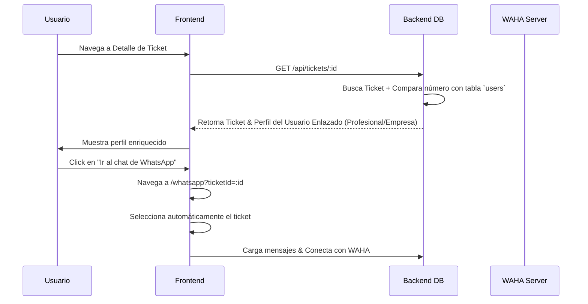

# Integración de WhatsApp

Este documento detalla la arquitectura, el diseño y las especificaciones técnicas de la integración con **WhatsApp HTTP API (WAHA)** en Obertrack.

---

## 1. Arquitectura y Componentes

La integración se divide en dos grandes áreas: el backend que gestiona la persistencia y la sincronización, y el frontend que provee la interfaz gráfica interactiva.

### Diagrama de Flujo (Selección e Integración)


---

## 2. Backend: Enlace con Usuarios Registrados

En el endpoint de obtención del detalle del ticket (`GET /api/tickets/:id`), el backend comprueba si el número de teléfono del contacto del ticket coincide con algún usuario registrado en la base de datos para mostrar información enriquecida (cargo, empresa, sector, etc.).

### Lógica de Comparación (`ticket_handler.go`)
Se realiza una limpieza del número almacenado (removiendo espacios, caracteres especiales e indicativos como el `+`) para garantizar coincidencia incluso con diferentes formatos de entrada:

```go
var linkedUser *models.User
if ticket.Contact.Phone != "" {
    var u models.User
    cleanPhone := ticket.Contact.Phone
    // Se eliminan "+" y espacios para una comparación segura
    if err := h.DB.Where(
        "REPLACE(REPLACE(phone_number, '+', ''), ' ', '') = ?", cleanPhone,
    ).First(&u).Error; err == nil {
        linkedUser = &u
    }
}
```

---

## 3. Frontend: Componentes Modularizados

Para asegurar un desarrollo limpio, escalable y mantenible bajo buenas prácticas, la página de WhatsApp (`WhatsApp.tsx`) se dividió en tres componentes específicos dentro de `src/pages/WhatsApp/`:

1. **`ChatList.tsx`**:
   - Administra el buscador de conversaciones.
   - Muestra el estado del servidor WAHA (Conectado / Desconectado).
   - Renderiza el código QR para vinculación si el dispositivo no está enlazado.
   - Lista los tickets activos con previsualización del último mensaje.

2. **`ChatWindow.tsx`**:
   - Renderiza el chat de la conversación activa y el flujo de burbujas de mensajes.
   - Incorpora el input de envío rápido y soporte para mandar mensajes vía WhatsApp.
   - Ofrece herramientas de administración en cabecera: vincular empresa principal y editar el contacto/empresa in-situ.

3. **`EmptyState.tsx`**:
   - Vista estética y limpia de bienvenida cuando no hay ningún chat activo seleccionado.

---

## 4. Diseño Adaptable y Responsivo

El diseño está optimizado para todo tipo de pantallas (Móviles, Tablets y Escritorios):

* **Escritorio**: Diseño clásico estilo WhatsApp Web de doble columna (Sidebar lateral de chats + Ventana de conversación activa a la derecha).
* **Móviles (<640px)**: 
  - La Sidebar toma el 100% de la pantalla para navegación inicial.
  - Al abrir un chat, la Sidebar se oculta (`.sidebarHidden`) y la ventana de chat (`ChatWindow`) se posiciona de forma absoluta cubriendo el 100% de la pantalla.
  - Se activa el botón de retorno (`backBtn`) para regresar suavemente a la lista de chats.
