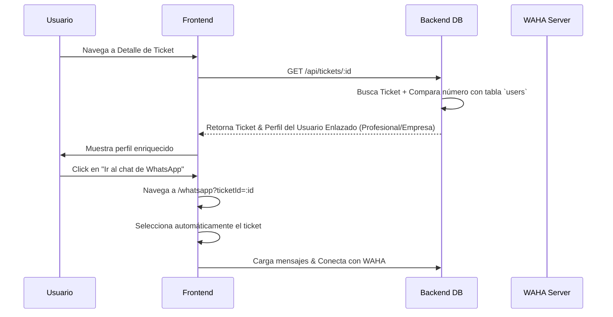

# Integración de WhatsApp

Este documento detalla la arquitectura, el diseño y las especificaciones técnicas de la integración con **WhatsApp HTTP API (WAHA)** en Obertrack.

---

## 1. Arquitectura y Componentes

La integración se divide en dos grandes áreas: el backend que gestiona la persistencia y la sincronización, y el frontend que provee la interfaz gráfica interactiva.

### Diagrama de Flujo (Selección e Integración)

```mermaid
sequenceDiagram
    participant U as Usuario
    participant FE as Frontend
    participant BE as Backend DB
    participant WA as WAHA Server

    U->>FE: Navega a Detalle de Ticket
    FE->>BE: GET /api/tickets/:id
    BE->>BE: Busca Ticket + Compara número con tabla `users`
    BE-->>FE: Retorna Ticket & Perfil del Usuario Enlazado (Profesional/Empresa)
    FE->>U: Muestra perfil enriquecido
    U->>FE: Click en "Ir al chat de WhatsApp"
    FE->>FE: Navega a /whatsapp?ticketId=:id
    FE->>FE: Selecciona automáticamente el ticket
    FE->>BE: Carga mensajes & Conecta con WAHA
```

---

## 2. Backend: Enlace con Usuarios Registrados

En el endpoint de obtención del detalle del ticket (`GET /api/tickets/:id`), el backend comprueba si el número de teléfono del contacto del ticket coincide con algún usuario registrado en la base de datos para mostrar información enriquecida (cargo, empresa, sector, etc.).

### Lógica de Comparación (`ticket_handler.go`)
Se realiza una limpieza del número almacenado (removiendo espacios, caracteres especiales e indicativos como el `+`) para garantizar coincidencia incluso con diferentes formatos de entrada:

```go
var linkedUser *models.User
if ticket.Contact.Phone != "" {
    var u models.User
    cleanPhone := ticket.Contact.Phone
    // Se eliminan "+" y espacios para una comparación segura
    if err := h.DB.Where(
        "REPLACE(REPLACE(phone_number, '+', ''), ' ', '') = ?", cleanPhone,
    ).First(&u).Error; err == nil {
        linkedUser = &u
    }
}
```

---

## 3. Frontend: Componentes Modularizados

Para asegurar un desarrollo limpio, escalable y mantenible bajo buenas prácticas, la página de WhatsApp (`WhatsApp.tsx`) se dividió en tres componentes específicos dentro de `src/pages/WhatsApp/`:

1. **`ChatList.tsx`**:
   - Administra el buscador de conversaciones.
   - Muestra el estado del servidor WAHA (Conectado / Desconectado).
   - Renderiza el código QR para vinculación si el dispositivo no está enlazado.
   - Lista los tickets activos con previsualización del último mensaje.

2. **`ChatWindow.tsx`**:
   - Renderiza el chat de la conversación activa y el flujo de burbujas de mensajes.
   - Incorpora el input de envío rápido y soporte para mandar mensajes vía WhatsApp.
   - Ofrece herramientas de administración en cabecera: vincular empresa principal y editar el contacto/empresa in-situ.

3. **`EmptyState.tsx`**:
   - Vista estética y limpia de bienvenida cuando no hay ningún chat activo seleccionado.

---

## 3.bis Notas operativas de la API de WAHA

Detalles verificados contra la instancia (WAHA `2026.7.1`, engine `WEBJS`) que no son evidentes leyendo la documentación:

### Forma de las URLs (no es uniforme)
| Recurso | Forma correcta |
|---|---|
| Contactos | `/api/contacts?session=X`, `/api/contacts/all?session=X` (**query param**) |
| Chats | `/api/{session}/chats/overview`, `/api/{session}/chats/{chatId}/messages` (**path**) |
| Sesiones | `/api/sessions/{session}`, `/api/sessions/{session}/start` |
| Envío | `/api/sendText` (la sesión va en el body) |

Usar la forma de path para contactos (`/api/{session}/contacts/all`) devuelve **HTTP 500**.

### Identificadores: `@lid` vs `@c.us`
WhatsApp ya no identifica las conversaciones 1:1 por número. En esta instancia **26 de 26** chats individuales usan LID (`112828824473809@lid`) y ninguno `@c.us`. Filtrar por `@c.us` descarta todas las conversaciones reales.

El teléfono real se resuelve pidiendo el contacto por su LID:

```
GET /api/contacts?session=session_1&contactId=112828824473809%40lid
→ {"id":"17873491050@c.us","number":"112828824473809","name":"Edgardo Vázquez"}
```

Es decir: **`id` trae el JID con el teléfono; `number` trae el LID**. `WahaContactResponse.RealPhone()` lee el prefijo de `id`.

### Multimedia
El endpoint de historial devuelve `type: null` en el engine WEBJS. La única señal fiable de adjunto es el booleano **`hasMedia`** (y, si viene, `media.mimetype`). Los mensajes sin texto se guardan con un marcador (`📷 Imagen recibida`, `📄 Documento recibido`, …) vía `service.MediaPlaceholder`.

### Requisitos de configuración
- `WAHA_SESSION` debe coincidir **exactamente** con el nombre en `GET /api/sessions?all=true`. Si no existe, toda llamada responde `422 Session "X" does not exist` y el módulo queda inerte sin error visible en la UI.
- La sesión debe tener el webhook registrado apuntando a `POST /api/webhooks/waha` con HMAC-SHA512 y el mismo secreto que `WAHA_WEBHOOK_HMAC`. Sin webhook (`"webhooks": []`) no entra ningún mensaje.
- El webhook descarta los eventos cuyo campo `session` no coincida con `WAHA_SESSION`: el HMAC es compartido entre todas las sesiones de la instancia.

### Envío saliente: bandeja de salida (outbox)

El envío **no ocurre dentro del request**. `SendWhatsAppReply` valida, persiste el mensaje con `delivery_status='pending'` y devuelve al instante; `WhatsAppOutbox` (worker, [whatsapp_outbox.go](../../backend/internal/service/whatsapp_outbox.go)) lo entrega en segundo plano.

Motivo: antes una caída de WAHA o un reinicio del backend perdía la respuesta del agente sin dejar rastro, y el request cargaba con los ~6s del antibaneo, así que dos agentes respondiendo a la vez se hacían cola.

El estado vive en la propia fila de `ticket_messages` (no en una tabla de jobs) porque el chat necesita mostrarlo por mensaje:

| Columna | Significado |
|---|---|
| `delivery_status` | `pending` / `sent` / `failed`. **Vacío = no aplica**: entrantes, notas internas y todo el histórico previo al outbox |
| `delivery_attempts` | intentos consumidos (tope `DeliveryMaxAttempts` = 6) |
| `next_attempt_at` | a partir de cuándo puede retomarse; NULL = ya. Sobrevive al reinicio, que es lo que hace real al backoff |
| `delivery_error` | último error, para diagnóstico |

Backoff: 15s → 1m → 5m → 15m → 1h (satura en el último escalón).

Reglas del worker:
- **Éxito** → `sent` + se guarda el ID de WAHA como `external_id`, que es lo que evita que el import de historial duplique las respuestas ya enviadas.
- **Límite antibaneo** (`ErrRateLimited`) → se pospone 5s **sin gastar intento**: la cola no falló, solo va a su ritmo. Contarlo agotaría los reintentos de una ráfaga legítima sin haber tocado WAHA.
- **Ticket sin contacto** → se agota de inmediato; esperar no lo arregla.
- **Resto** (red, 5xx) → reintento con backoff hasta agotar.

Dentro de cada intento, `WahaService.SendMessage` reserva turno (`reserveSlot`) según `WAHA_MAX_MSGS_PER_MIN` y `WAHA_MIN_SEND_INTERVAL_MS`, espera **fuera** del mutex, simula tecleo y reintenta hasta 3 veces ante fallos transitorios. Un 4xx como el 422 no se reintenta.

El chequeo de cold-outreach sigue siendo síncrono: es una consulta local y el agente debe enterarse en el acto de que no puede escribir primero.

En el chat, un mensaje propio muestra reloj (pendiente), doble check (entregado) o aviso en rojo (no entregado).

---

## 3.b Ingesta: webhook (tiempo real) y re-sincronización (red de seguridad)

Los mensajes entran por dos caminos, y hay que entender que **solo el primero es en tiempo real**.

### Webhook

WAHA notifica cada mensaje a `POST /api/webhooks/waha`, firmado con HMAC-SHA512 sobre el cuerpo crudo en la cabecera `X-Webhook-Hmac`. El middleware falla cerrado: sin `WAHA_WEBHOOK_HMAC` responde 503, y con firma incorrecta 401.

Se registra **un solo evento, `message.any`**, que ya incluye los entrantes y lo escrito desde el teléfono. Añadir también `message` haría que cada mensaje entrante llegara dos veces: la idempotencia por `external_id` lo absorbe, pero se duplica el trabajo y aparece una carrera al crear contacto y ticket.

Registro en la sesión (`PUT /api/sessions/{sesión}`, cabecera `X-Api-Key`):

```jsonc
{
  "name": "OsvellTest",
  "config": {
    "webhooks": [{
      "url": "https://obertrack.com/api/webhooks/waha",
      "events": ["message.any"],
      "hmac": { "key": "<el mismo valor que WAHA_WEBHOOK_HMAC del backend>" },
      "retries": { "policy": "linear", "delaySeconds": 2, "attempts": 15 }
    }]
  }
}
```

Tres cosas tienen que coincidir o los mensajes se descartan en silencio:

1. **La URL debe ser alcanzable desde WAHA.** Un backend en `localhost` no lo es. En desarrollo local el tiempo real no funciona sin un túnel (cloudflared/ngrok); se trabaja con la re-sincronización y el botón.
2. **El HMAC** debe ser idéntico al `WAHA_WEBHOOK_HMAC` del backend, o todo entra como 401.
3. **`WAHA_SESSION` del backend debe coincidir con el nombre de la sesión.** El handler descarta lo que venga de otra sesión (`sesión inesperada`) porque una instancia de WAHA puede alojar varias y el HMAC es compartido.

Verificación rápida de que el endpoint está vivo y comparte secreto — el handler ignora los eventos que no son mensaje, así que no tiene efecto:

```bash
BODY='{"event":"ping","session":"OsvellTest"}'
SIG=$(printf '%s' "$BODY" | openssl dgst -sha512 -hmac "$WAHA_WEBHOOK_HMAC" -hex | awk '{print $2}')
curl -s -X POST https://obertrack.com/api/webhooks/waha \
  -H "Content-Type: application/json" -H "X-Webhook-Hmac: $SIG" -d "$BODY"
# 200 {"status":"ignored"} = ruta viva y HMAC correcto. 401 = secreto distinto.
```

### Re-sincronización periódica

`ChatImportWatcher` trae el historial al conectar la sesión y luego cada `WAHA_RESYNC_MINUTES` (5 por defecto) mientras siga conectada. Es idempotente por `external_id`, así que repetir solo añade lo nuevo.

Existe porque el webhook puede no estar llegando —sesión sin webhook, backend inalcanzable, caída de red— y antes el import corría **una sola vez por conexión**: la bandeja se quedaba congelada en la última sincronización que entró, y la única salida era reiniciar la sesión de WhatsApp.

El botón **"Traer mensajes"** de la cabecera (`POST /api/tickets/waha/sync`) dispara esa misma traída a mano. Un `TryLock` deja pasar una sola pasada a la vez: la segunda recibe 409 en vez de competir creando los mismos contactos y tickets.

Las lecturas pesadas (`chats/overview`, `chats/*/messages`, `contacts/all`) usan un cliente HTTP aparte con `WAHA_READ_TIMEOUT_S` (45s). Los plazos son opuestos a los del envío: un envío tiene que fallar rápido porque hay un agente esperando y porque reintentar duplica, mientras que leer el historial de una instancia remota simplemente tarda. Con los 10s del cliente de envío, el import se caía por timeout en cada vuelta.

---

## 4. Diseño Adaptable y Responsivo

El diseño está optimizado para todo tipo de pantallas (Móviles, Tablets y Escritorios):

* **Escritorio**: Diseño clásico estilo WhatsApp Web de doble columna (Sidebar lateral de chats + Ventana de conversación activa a la derecha).
* **Móviles (<640px)**: 
  - La Sidebar toma el 100% de la pantalla para navegación inicial.
  - Al abrir un chat, la Sidebar se oculta (`.sidebarHidden`) y la ventana de chat (`ChatWindow`) se posiciona de forma absoluta cubriendo el 100% de la pantalla.
  - Se activa el botón de retorno (`backBtn`) para regresar suavemente a la lista de chats.
